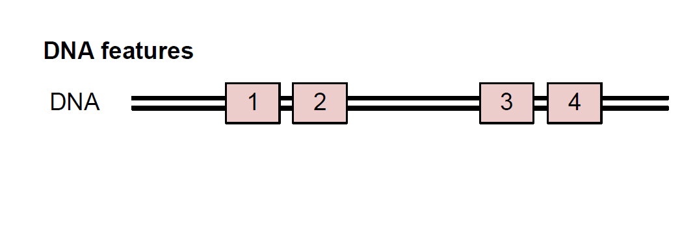
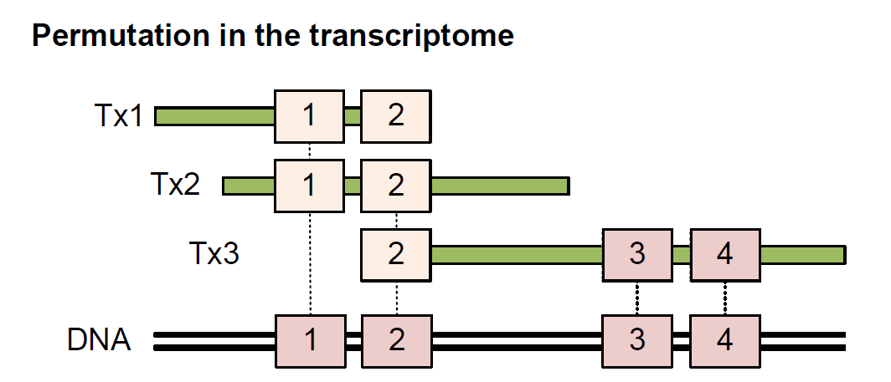
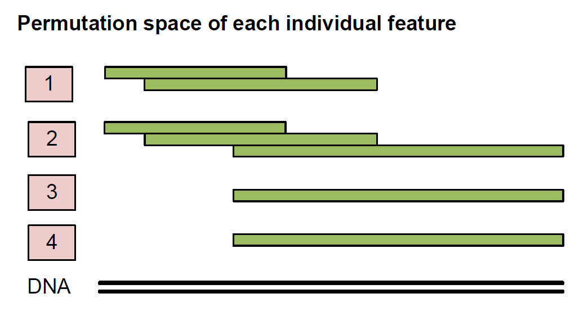
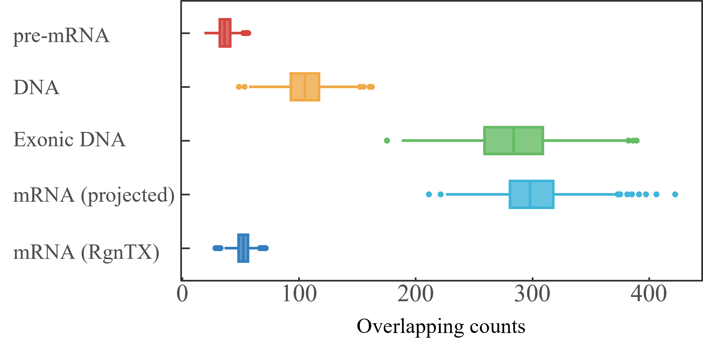
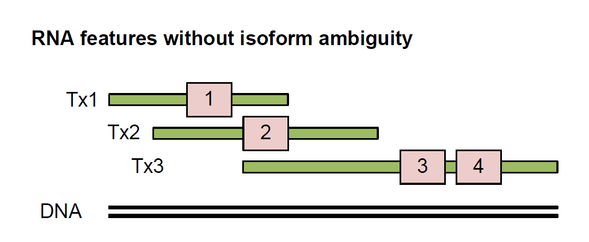
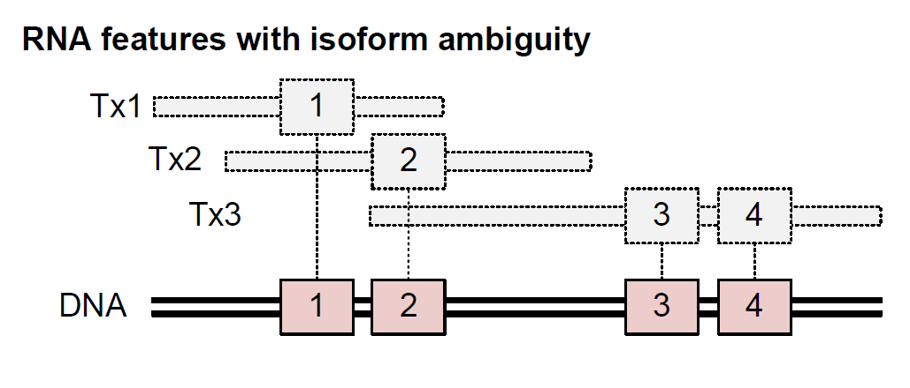
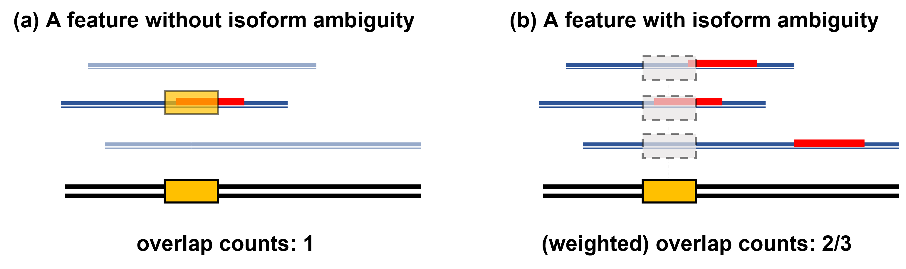
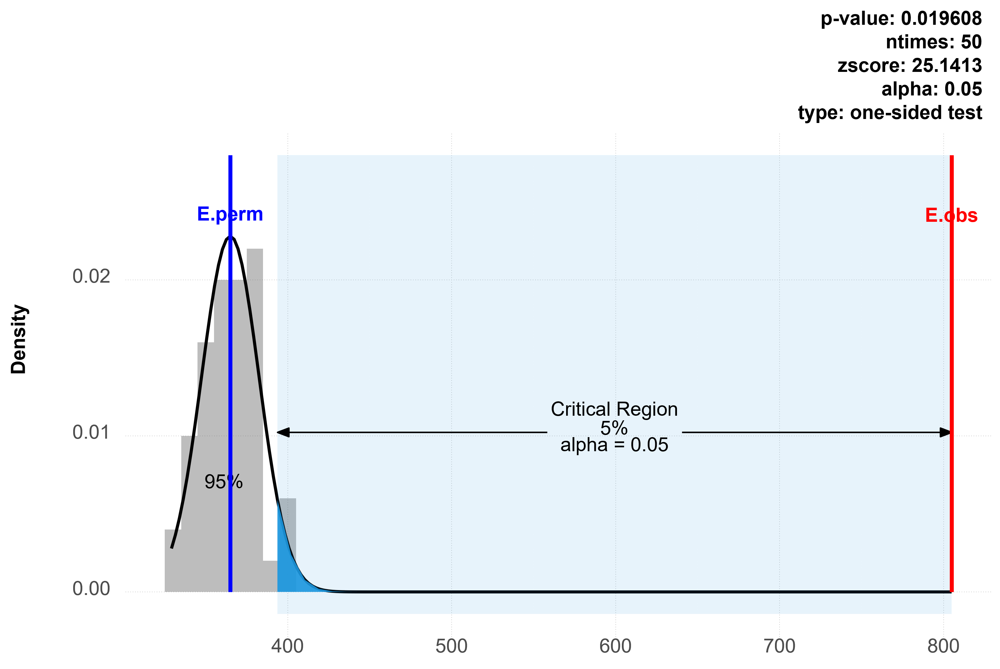

```{r, include=FALSE}
library(knitr)
opts_chunk$set(concordance=FALSE)
set.seed(12345677)
```

```{r, echo=FALSE, warning=FALSE, message=FALSE}
library(RgnTX)
library(TxDb.Hsapiens.UCSC.hg19.knownGene)
```

# Introduction
Recent development of high-throughput sequencing technology has generated large amounts of data at transcriptome level such as RNA-binding protein target sites, RNA modifications and other RNA-related genomic features. These transcriptome attributes can be converted to a set of locations or regions.

Currently, colocalization analysis of two genomic region sets has been widely used to infer potential interactions between corresponding biological attributes. A number of methods have been developed for this. For example, `r BiocStyle::Biocpkg("regioneR")` has been created to statistically estimate association between genomic region sets using a permutation test framework. All its functions are genome and mask-aware. However, there has been no such tools enable researchers to make data analysis and interpretation at transcriptome level. Here [RgnTX](https://github.com/yue-wang-biomath/RgnTX) is invented to fill this blank. 

[RgnTX](https://github.com/yue-wang-biomath/RgnTX) extends an assumption-free permutation test framework transcriptome-wide. Different from existing approaches, [RgnTX](https://github.com/yue-wang-biomath/RgnTX) allows the integration of transcriptome annotations so as to model the complex alternative splicing patterns. Importantly, it also supports the testing of transcriptome elements without clear isoform association, which is often the real scenario due to technical limitations.


[RgnTX](https://github.com/yue-wang-biomath/RgnTX) makes a useful tool for transcriptome region set association analysis. In this vignette, with some simulated datasets, we show that permutation tests conducted in the genome and the transcriptome are significantly different and may return distinct results in section [2](#what-is-the-difference-between-permutation-tests-in-the-genome-and-the-transcriptome). The most core functions for conducting permutation tests and examples with real datasets are introduced in section [5](#permutation-test-function).

# What is the difference between permutation tests in the genome and the transcriptome? 

## What does a permutation test do?

Suppose we want to know if a region set A has some association with another region set B. We could pick some random region sets, and calculate the number of overlaps between them and B. If the overlap numbers of these random region sets and B are generally smaller than that of A and B, it is more likely to say there exists some association between A and B, otherwise not. 

Such permutation test framework mainly involves two steps: the randomization step (picking random region sets) and the evaluation step (evaluating overlapping counts or other test statistic). Importantly, performing it over the transcriptome and the genome can be different in both of these two steps. 

## Randomization step

Compared with the linear genome space, transcriptome space is heterogeneous due to the existence of multiple isoform transcripts, the splicing junctions and exons used by different frequencies. The isoform specificity of transcriptome elements is often lost in the process of mapping due to technical limitations. To perform isoform-aware permutation for transcriptome element with isoform ambiguity, [RgnTX](https://github.com/yue-wang-biomath/RgnTX) considers only the transcripts that overlap with it when projected to the genome, so as to retrain maximal isoform information. In this example shown by the following figures, feature 3 will be permutated on transcript Tx3 only, while feature 2 will be permutated on all the 3 transcripts.

```{r  Fig1, fig.cap = "The genome space is linear. The figure shows four genomic features in the genome.", echo=FALSE, out.width='.60\\linewidth'}

```

```{r  Fig2, fig.cap = "The transcriptome space is heterogeneous. It is usually unclear which specific isoform transcript is associated with the transcriptome element because it overlaps with multiple isoforms when mapped to the genome, which is often the real scenario in biological research.", echo=FALSE, out.width='.60\\linewidth'}

```

```{r  Fig3, fig.cap = "Permutation space for each feature is distinct. Each feature will be permutated only within the set of isoform transcripts it is associated with.", echo=FALSE, out.width='.60\\linewidth'}

```

This is supported by the [RgnTX](https://github.com/yue-wang-biomath/RgnTX) function `randomizeFeaturesTx` and the function `randomizeFeaturesTxIA`. The former is for features with known isoform belongings. The latter is for features with isoform ambiguity (IA). Besides, [RgnTX](https://github.com/yue-wang-biomath/RgnTX) also provides function `randomizeTx` supporting picking random region sets within any specified transcriptome space.  Users can choose a suitable strategy to do randomization conveniently within only a few lines of codes. More details about this are introduced in section [4](#randomization-function).

## Evaluation step
Another non-trivial task is to develop evaluation function for a test statistic, such as the number of overlaps, to be tested between two region sets. A key limitation of existing evaluation approaches is that, they were designed primarily for genome-based evaluation. Two transnscriptome elements with shared exons but are located on the independent transcripts are also considered to have overlaps by them. The information of transcripts is totally lost during comparison, which can induce substantial bias when applying to analyze transcriptome region sets.

[RgnTX](https://github.com/yue-wang-biomath/RgnTX) provides several strategies for transcriptome-level evaluation. Function `overlapCountsTX` counts the number of overlaps between two transcriptome elements in the transcriptome directly. Function `overlapCountsTXIA` calculates a weighted number of overlaps between a feature set (with isoform ambiguity) and a transcriptome region set (without isoform ambiguity). It is also possible to write a custom evaluation function and pass it to the main permutation test function. Details about this part are introduced in section [6](#evaluation-function).

## Comparison of permutations over different kinds of spaces 

We perform a series of simulations to show the difference of permutation tests conducted in the transcriptome and in the genome.

In this simulation, we randomly generated 1000 pairs of region sets in the following four spaces, with each region set containing 500 regions of 200nt long on the same 300 genes, and then count the number of overlaps between each pair.

* **DNA**: This space contains randomly picked 300 genes from a hg19 TxDb object. 

* **pre-mRNA**: It contains all of the pre-mRNAs that pertain to the previously picked 300 genes.

* **mRNA**: It contains all of the mRNAs that pertain to the previously picked genes.

* **Exonic DNA**: This space involves only the part of genome that is related to the previously picked mRNAs. It is actually a linear space of these mRNAs.

Figure \@ref(fig:Fig4) shows the evaluation results. In the first four cases, overlaps are counted based on the genome (or after projection). In the last case, overlaps are counted in the transcriptome directly. The former four cases are evaluated by `r BiocStyle::Biocpkg("regioneR")` function `numOverlaps`, while the last is evaluated by [RgnTX](https://github.com/yue-wang-biomath/RgnTX) function `overlapCountsTx`.

```{r  Fig4, fig.cap = "Overlapping counts between random region sets in different permutation spaces. Box boundaries represent the 25th and 75th percentiles; center line represents the median.", echo=FALSE, out.width='.80\\linewidth'}

```

As the results show, permutations over different genome and transcriptome space return distinct results. A small number of overlaps are observed in the transcriptome (the last case), which is not surprising due to the existence of multiple isoform transcripts. Interestingly, the results from exonic DNA and mRNA (projected to genome) are also different, which is due to exons used at different frequencies by isoform transcripts. These results suggest that the permutation of heterogeneous transcriptome elements can be substantially more complex than genome-based elements. Genome-based methods are not appropriate to analyze transcriptome elements. That’s why we develop [RgnTX](https://github.com/yue-wang-biomath/RgnTX) to do this.

# Feature/region format in RgnTX

[RgnTX](https://github.com/yue-wang-biomath/RgnTX) is based on the `r BiocStyle::Biocpkg("GenomicRanges")` and `r BiocStyle::Biocpkg("GenomicFeatures")` structure. In this section, we introduce the format of region sets and other associated metadata used in [RgnTX](https://github.com/yue-wang-biomath/RgnTX).

* **TxDb object used in RgnTX** 

A TxDb object stores transcripts, exons, CDS and other types of genomic features. A TxDb object is usually required by [RgnTX](https://github.com/yue-wang-biomath/RgnTX) functions. Currently, all the examples in this vignette are based on the `TxDb.Hsapiens.UCSC.hg19.knownGene`. Users can assign other TxDb objects via related function arguments.

* **Transcript ids and names**

A TxDb object provides default ids and names for transcripts. According to `r BiocStyle::Biocpkg("GenomicFeatures")`, a transcript is guaranteed to be related to a unique transcript id. But a transcript's name is not guaranteed to be unique or even defined. In this vignette, all the examples use transcript ids instead of names to indicate specific transcripts.  

Please pay attention not to confuse the transcript ids with other types of ids, such as ids for CDS, exons and other genomic features provided by a TxDb object, or external ids for genes like Entrez Gene and Ensembl ids. Functions in [RgnTX](https://github.com/yue-wang-biomath/RgnTX) will not work with wrong types of ids.    
	
* **Input feature set should be either GRanges or GRangesList**

The feature/region sets in [RgnTX](https://github.com/yue-wang-biomath/RgnTX) should be either `GRanges` or `GRangesList`.  

For a `GRangesList` feature set, every list element that contains a set of ranges is a feature. For a `GRanges` feature set without special instructions, a single range is a feature. For a `GRanges` feature set containing a metadata column named "group", the set of ranges having the same group number is a feature. 

The transcript ids (if available) should be provided as follows. For `GRangesList` objects, the name of each list element (feature) should be the id of the transcript that this feature is located on. For `GRanges` objects, transcript ids should be contained in a metadata column named "transcriptsHits". 

Here is an example of `GRangesList` feature set following the format required by [RgnTX](https://github.com/yue-wang-biomath/RgnTX). Its names should be transcript ids.

```{r, message=FALSE, warning=FALSE}
library(TxDb.Hsapiens.UCSC.hg19.knownGene)
txdb <- TxDb.Hsapiens.UCSC.hg19.knownGene

set.seed(12345677)
example.list <- randomizeTx(txdb, random_num = 10, random_length = 200)
example.list
```

The following `GRanges` object represents the same region set as the above one. Ranges having the same group number represent a feature. The `transcriptsHits` column contains corresponding transcript ids. Both formats are accepted by [RgnTX](https://github.com/yue-wang-biomath/RgnTX) functions and can be transformed to each other via function `GRangesList2GRanges` and function `GRanges2GRangesList`.

```{r, message=FALSE, warning=FALSE}
example.gr <- GRangesList2GRanges(example.list)
example.gr
example.list <- GRanges2GRangesList(example.gr)
```

# Randomization function

In [RgnTX](https://github.com/yue-wang-biomath/RgnTX), there are mainly two kinds of randomization functions. One can pick random regions over a specified space (see section [4.1](#pick-random-regions-over-a-specified-space)). One can also randomize specified features into transcriptome, i.e., input a set of features and get a randomized result of it (see section [4.2](#randomize-features-into-transcriptome)).

## Pick random regions over a specified space

In this strategy, users need to specify a scope that random region sets will be picked from.

### randomizeTx function

In this function, users can pass transcript ids via an argument to make random regions to be picked from the transcripts having these ids.   

**Step 1: specify a randomization space**

One needs to determine three arguments: a TxDb data, a set of transcript ids and the type of randomized regions the function will return. As an example, we specify a randomization space formed by five mRNAs.

```{r, warning=FALSE, message=FALSE}
txdb <- TxDb.Hsapiens.UCSC.hg19.knownGene 
type <- "mature"
trans.ids <- c("170", "782", "974", "1364", "1387")
```
We feed them into the `randomizeTX` function.

**Step 2: randomizeTx function**

We use this function to pick 10 random regions, and each region is 100 nt long. Each region is picked from a random transcript among the input transcripts.
```{r, warning=FALSE, message=FALSE}
set.seed(12345677)
randomResults <- randomizeTx(txdb, trans_ids = trans.ids, random_num = 10,
                             random_length = 100)
```

* **txdb**: a TxDb obejct.

* **trans_ids** (default: "all"): the ids of transcripts, which should be a character object. If this argument takes the default value `all`, random regions will be picked from the whole transcriptome.

* **random_num**: the number of regions to be picked.

* **random_length**: the length of each region to be picked.

* **type** (default: "mature"): this argument receives options `mature`, `full`, `fiveUTR`, `CDS` or `threeUTR`, with which users can get corresponding types of random regions. Default is "mature", with which the function picks regions over mRNAs.

* **N** (default: 1): randomization times. The number of sets of region sets the function will return.

```{r, warning=FALSE, message=FALSE}
randomResults 
```

```{r, warning=FALSE, message=FALSE}
width(randomResults)
```

The function returns a `GRangesList` object. Every list element has a total length of 100 nt and represents a region on mRNA but possibly separated by intron parts. The name of each element is its relative transcript id. 

### randomizeTransByOrder function

This is another randomization function. The difference of this function and `randomizeTx` is that it does not take an argument about transcript ids, instead, it takes a `GRangesList` region set and picks only one random region within the space indicated by every `GRangesList` element. So the number of regions in a set this function returns is equal to the number of elements in the input `GRangesList` object.
   
**Step 1: specify a randomization space**

We pick a set of five mRNAs to be the scope of randomization.

```{r, warning=FALSE, message=FALSE}
trans.ids <- c("170", "782", "974", "1364", "1387")
exons.tx0 <- exonsBy(txdb)
regions.A <- exons.tx0[trans.ids]
regions.A
```

**Step 2: randomizeTransByOrder function**

`randomizeTransByOrder` requires two inputs: a region set with `GRangesList` format as the randomization scope, and the length of each random region is going to be picked from every `GRangesList` element. 

In the following example, we input a region set containing five regions. The function picks five 100 nt regions from each of them in order. 

```{r, warning=FALSE, message=FALSE}
set.seed(12345677)
random.regions.A <- randomizeTransByOrder(regions_A = regions.A, 
random_length = 100)
width(regions.A)
width(random.regions.A)
```

## Randomize features into transcriptome

Functions introduced in this section support randomizing two kinds of RNA-related genomic features:

* **Features without isoform ambiguity**: for features without isoform ambiguity, it is clear which specific isoform each feature is located on (See Figure \@ref(fig:Fig5)). Each feature will be randomized within its relative transcript.

* **Features with isoform ambiguity**: the isoform specificity of transcriptome elements is unclear to us because each of them overlaps with multiple isoforms when mapped to the genome (See Figure \@ref(fig:Fig6)). Each feature will be randomized into the set of isoform transcripts it is associated with.

```{r  Fig5, fig.cap = "Features without isoform ambiguity.", echo=FALSE, out.width='.80\\linewidth'}

```

```{r  Fig6, fig.cap = "Features with isoform ambiguity.", echo=FALSE, out.width='.80\\linewidth'}

```

### randomizeFeatruesTx function

This function is for randomizing a feature set that does not have isoform ambiguity problem.

**Step 1: Specify a feature set (without isoform ambiguity)**

We expect users to input features following the format stated in section [3](#featureregion-format-in-rgntx), i.e., either to be a `GRanges` or `GRangesList` object with corresponding required metadata.

We generate a region set containing 100 regions of 100nt long as an example feature set.

```{r, message=FALSE, warning=FALSE}
txdb <- TxDb.Hsapiens.UCSC.hg19.knownGene
trans.ids<- c("170", "782", "974", "1364", "1387")
RS1 <-  randomizeTx(txdb, trans.ids, random_num = 100, random_length = 100)
```

**Step 2: randomizeFeaturesTx function**

Once we have a feature set, we can use `randomizeFeaturesTx` function to randomize it. This function takes each feature, randomizes its position only within its corresponding transcript that it belongs to and keeps the original size and other associated data.

```{r, warning=FALSE, message=FALSE}
randomResults <- randomizeFeaturesTx(RS1, txdb, type = "mature")
```

By setting the argument `type`, one can randomize input feature set into different types of transcriptome space. The above example picks random regions from mRNAs. The below example only picks random regions from CDS.

```{r, warning=FALSE, message=FALSE}
randomResults <- randomizeFeaturesTx(RS1, txdb, type = "CDS")
```

By setting the argument `N`, one can get multiple sets of randomized region sets of the input feature set. 

```{r, warning=FALSE, message=FALSE}
randomResults <- randomizeFeaturesTx(RS1, txdb, N = 5)
```

### randomizeFeatruesTxIA function

This function is for randomizing a feature set that has isoform ambiguity.

**Step 1: Specify features with isoform ambiguity**

We expect users to input features following the format stated in section [3](#featureregion-format-in-rgntx). For features with isoform ambiguity, users do not need to provide transcript information.
 
Here we load an m$^6$A dataset as an input feature.

```{r, message=FALSE, warning=FALSE}
file <- system.file(package="RgnTX", "extdata/m6A_sites_data.rds")
m6A_sites_data <- readRDS(file)
m6A_sites_data[1:5]
```

**Step 2: randomizeFeaturesTxIA function**

One does not know the specific transcript that each m$^6$A feature is associated with. When doing randomization, this function takes each feature and randomizes its position only within the set of isoform transcripts that each feature can be mapped to. We input five features and get five random regions. Each random region is corresponding to each feature.

```{r,  message=FALSE, warning=FALSE}
randomResults <- randomizeFeaturesTxIA(RS = m6A_sites_data[1:5], 
                                       txdb, type = "mature", N = 1)
length(randomResults)
```

# Permutation test function

The most important task of [RgnTX](https://github.com/yue-wang-biomath/RgnTX) is to analyze transcriptome region set association via a permutation test framework. There are several permutation test functions. They require different input ways and support user's different needs. All the functions finally return a report that reflects the level of association being tested and can be visualized by a plot function.

## Test between two region sets

This is the most basic strategy. It requires users to input a feature set (to be randomized) and a region set (to be compared with), and evaluates if there is an association between them.

### permTestTx function

The `permTestTx` function is for features without isoform ambiguity. As an example, we generate two region sets A and B. As shown below, by our design they have at least 50 overlaps. We feed them into `permTestTx`.

```{r, message=FALSE, warning=FALSE}
set.seed(12345677)
library(TxDb.Hsapiens.UCSC.hg19.knownGene)
txdb <- TxDb.Hsapiens.UCSC.hg19.knownGene
exons.tx0 <- exonsBy(txdb)
trans.ids <- sample(names(exons.tx0), 50)

A <- randomizeTx(txdb, trans.ids, random_num = 100, random_length = 100)
B <- c(randomizeTx(txdb, trans.ids, random_num = 50, random_length = 100), 
       A[1:50])

permTestTx_results <- permTestTx(RS1 = A, 
                                 RS2 = B, 
                                 txdb = txdb, 
                                 type = "mature",
                                 ntimes = 50, 
                                 ev_function_1 = overlapCountsTx, 
                                 ev_function_2 = overlapCountsTx)
```

This function involves these arguments:

* **RS1**: a feature set to be randomized.

* **RS2**: a region set to be compared with the feature set.

* **txdb**: a TxDb object.

* **type** (default: "mature"): The type of transctiptome space that the feature set will be randomized into. See section [4.1.1](#randomizetx-function) for more details.

* **ev_function_1** (default: overlapCountsTx): evaluation function that defines what statistic to be tested between RS1 and RS2. Default is [RgnTX](https://github.com/yue-wang-biomath/RgnTX)  function `overlapCountsTx`. See section [6.1](#overlapcountstx-function) for more details.

* **ev_function_2** (default: overlapCountsTx): evaluation function that defines what statistic to be tested between randomized region sets and RS2.

* **pval_z** (default: FALSE): there are two ways of calculating p-values. If this Boolean is `FALSE`, p-value is calculated by counting the percent of more extreme cases (with more overlaps) in random permutation than the real observation. If `TRUE`, p-value is calculated based on a z-test.

Among the above arguments, users must at least provide a feature set RS1, a region set RS2 and a TxDb object to the main function. 

The `permTestTx` function automatically randomizes the feature set RS1 and creates a set of randomized region sets, which is outputted as a list named as RSL (by its inner randomization function `randomizeFeatruesTx`). `permTestTx` uses the first evaluation function `ev_function_1` to calculate the test statistic between RS1 and RS2, and the second evaluation function to compute evaluations between each random region set in RSL and RS2. Finally, all these calculated results are returned as a list, which is defined to be a `permTestTx.results` object.

```{r, warning=FALSE, message=FALSE}
names(permTestTx_results)
```

* **RSL**: a set of randomized region sets of RS1.

* **orig.ev**: real observed evaluation. The number of overlaps between RS1 and RS2. 

* **rand.ev**: random evaluations. The overlapping counts between each element in RSL and RS2. 

* **pval**: p-value of the test.

* **zscore**: standard z-score of the test.

To get a more intuitive view of the result, we can plot it by `plotPermResults` function.

```{r Fig7, fig.cap = "Association between two region sets.", warning=FALSE, message=FALSE}
p1 <- plotPermResults(permTestTx_results, binwidth = 1)
p1
```

The number of overlaps between A and B, i.e., `orig.ev`, should be at least 50. As results show, the random evaluations are much less than `orig.ev`. A p-value is calculated based on the number that the random evaluations are lower than real observed evaluation, which is less than the significance level 0.05 we set. Additionally, a z-score is computed, which is the distance between mean of random evaluations and real observed evaluation divided by standard deviation of random evaluations. The low p-value and high z-score suggest that there is a statistically significant association between A and B.

### permTestTxIA function

Different from `permTestTx`, this function is for features that have isoform ambiguity, i.e., features that one cannot make sure which specific transcript they are located on. For such feature, usually one can only know a several of isoforms that they can be mapped to. The `permTestTxIA` function randomizes such features into the corresponding set of isoforms by `randomizeFeatruesTxIA` function. It conducts the same protocol evaluating an association as function `permTestTx` does and also returns a `permTestTx.results` object.

## Test involving customPick function

This strategy needs users to provide a feature set and a customPick function. The customPick function should aim to pick a specific kind of regions over a transcript (taking transcript ids as input and outputting a region over each transcript). The aim of this kind of test functions is to evaluate association between input feature set and the customPick regions. For example, suppose one wants to know if some features are associated with the last 200 nt region of transcripts more than expected, one can write a function that picks the transcript’s last 200 nt, and pass this function as a customPick function to the test function, which will then conduct a permutation test to evaluate their association level. Writing this kind of customPick function (specifiy certain regions over a transcript) can be easily done with the help of `shiftTx` function in section [9](#other-useful-functions).

The input features may be with or without isoform ambiguity. For a feature without isoform ambiguity, default evaluation function (`overlapCountsTx`) checks if it has overlap with the customPick region (indicated in red) on the transcript where it is located on (see Fig. \@ref(fig:Fig8), a). If the answer is yes, the total number of overlaps is added to one and otherwise zero. While for a feature with isoform ambiguity, default evaluation function (`overlapCountsTxIA`) maps it with the customPick regions of all its isoforms (see Fig. \@ref(fig:Fig8), b), and every overlap is added not one, but one divided by the number of its isoforms, to the total number of overlaps. In this example, this feature is associated with three isoforms and overlapping with the customPick regions of two of them (indicated in red). Then a value of 2/3 is added to the total overlap.

```{r  Fig8, fig.cap = "Overlap counting ways of two kinds of features with the customPick regions.", echo=FALSE}

```

Function `permTestTx_customPick` is for features without isoform ambiguity, while function `permTestTxIA_customPick` is for features with this problem. In this kind of strategies, features are only mapped to the regions in transcripts that they are related to. More details and examples are stated below. 

### permTestTx_customPick function

As an example, we take a feature set from the CDS space, which contains 100 regions and each region is 200 nt long.

Suppose we do not know how these features are generated. We want to test if these features are associated with the CDS part of transcripts more than expected. To do that, we write a customPick function that can pick the CDS part of these transcripts.

```{r, warning=FALSE, message=FALSE}
getCDS = function(trans_ids, txdb,...){
  cds.tx0 <- cdsBy(txdb, use.names=FALSE)
  cds.names <- as.character(intersect(names(cds.tx0), trans_ids))
  cds = cds.tx0[cds.names]
  return(cds)
}
```

The customPick function should involve at least an argument **trans_ids** and an ellipsis (...) so that other arguments can be passed to the main test function through this ellipsis operator. The `permTestTx_customPick` function takes the feature set RS1 and the customPick function `getCDS`.

```{r Fig9, fig.cap = " Association between some features with CDS regions.", warning=FALSE, message=FALSE}

set.seed(12345677)
txdb <- TxDb.Hsapiens.UCSC.hg19.knownGene
RS1 <- randomizeTx(txdb, "all", random_num = 100, random_length = 200, 
                   type = "CDS")

permTestTx_results <- permTestTx_customPick(RS1 = RS1,
                                            txdb = txdb,
                                            customPick_function = getCDS,
                                            ntimes = 50,
                                            ev_function_1 = overlapCountsTx,
                                            ev_function_2 = overlapCountsTx)
p1 <- plotPermResults(permTestTx_results, binwidth = 1)
p1
```

As Fig. \@ref(fig:Fig9) shows, it is just as we expected that the overlap number between features and the picked CDS is 100, indicated by a red line, which squares with the fact that all these features are picked from the CDS.

### permTestTxIA_customPick function

This function receives a feature set (with isoform ambiguity) and a customPick function. 

Let’s take an example about testing association between N$^6$-Methyladenosine and the stop codon regions. The m$^6$A sites are derived from an miCLIP-seq dataset (Linder, et al., 2015). Due to technical restriction, it is not clear which specific transcript an m$^6$A feature is located on. 

To test this association, we wrote a customPick function `getStopCodon` picking the stop codon regions of transcripts. It actually picks the last 100 nt of CDS and the first 100 nt of 3'UTR of transcripts given transcript ids. If a given transcript's CDS or 3'UTR part is less than 100 nt, the function will just pick this less than 100 nt region. This function actually uses the function `shiftTx` in section [9](#other-useful-functions) provided by [RgnTX](https://github.com/yue-wang-biomath/RgnTX) to realize these tasks.

As a quick example, we feed 500 out of 9181 m$^6$A sites and this `getStopCodon` function into function `permTestTxIA_customPick`. Its default evaluation function calculates a weighted overlapping number between m$^6$A sites and the stop codon regions.

```{r Fig10, fig.cap = " Association between N6-Methyladenosine (500 sites) and stop codon regions.", warning=FALSE, message=FALSE}
set.seed(12345677)
txdb <- TxDb.Hsapiens.UCSC.hg19.knownGene
file <- system.file(package="RgnTX", "extdata/m6A_sites_data.rds")
m6A_sites_data <- readRDS(file)
RS1 <- m6A_sites_data[1:500]

permTestTx_results <- permTestTxIA_customPick(RS1 = RS1,
                                       txdb = txdb,
                                       customPick_function = getStopCodon,
                                       ntimes = 50,
                                       ev_function_1 = overlapCountsTxIA,
                                       ev_function_2 = overlapCountsTx)
p_a <- plotPermResults(permTestTx_results, binwidth = 1)
p_a
```

In addition, if one wants to test the whole 9181 m$^6$A sites with the stop codon, use the following codes, which will of course take a few more minutes than the case involves less data. 

```{r, eval = FALSE}
set.seed(12345677)
permTestTx_results <- permTestTxIA_customPick(RS1 = m6A_sites_data,
                                       txdb = txdb,
                                       customPick_function = getStopCodon,
                                       ntimes = 50)
p_b <- plotPermResults(permTestTx_results)
p_b
```

```{r  Fig11, fig.cap = " Association between N6-Methyladenosine and stop codon regions.", echo=FALSE}

```

The weighted number of overlaps between 9181 m$^6$A sites and stop codon regions is 804.93 (calculated by default evaluation function in [6.2](#overlapcountstxia-function)), while the mean of random evaluations is 365.28 (calculated by default evaluation function in [6.1](#overlapcountstx-function)). The low p-value shows that the association being tested is statistically significant. 

**References**:
Linder, B., et al. (2015) Single-nucleotide-resolution mapping of m$^6$A and m$^6$Am throughout the transcriptome. *Nat Methods*
**12(8)**: 767-772.

## Test with user-provided random sets

### permTestTx_customAll function

`permTestTx_customAll` needs users to provide at least three arguments: two region sets and a list of randomized region sets. 

We take an easy example to explain how this function should be used. We want to test the association between two region sets come from the same transcript. We pick two region sets RS1 and RS2 in a transcript that has the id "170", and pick random region sets within a larger space containing 5 transcripts.

```{r, warning=FALSE, message=FALSE}
set.seed(12345677)
txdb <- TxDb.Hsapiens.UCSC.hg19.knownGene
trans.ids1<- c("170")
RS1 <- randomizeTx(txdb = txdb, trans_ids = trans.ids1,
                   random_num = 20, random_length = 100)
RS2 <- randomizeTx(txdb = txdb, trans_ids = trans.ids1,
                   random_num = 20, random_length = 100)
trans.ids2 <-  c("170", "782", "974", "1364", "1387")
RSL <- randomizeTx(txdb = txdb, trans_ids = trans.ids2,
                   random_num = 20, random_length = 100, N = 50)
```

We feed these three elements into the `permTestTx_customAll` function.

```{r  Fig12, fig.cap = "Association between two region sets picked from the same transcript .", warning=FALSE, message=FALSE}
permTestTx_results <- permTestTx_customAll(RSL = RSL, RS1 = RS1, RS2 = RS2)
p_3 <- plotPermResults(permTestTx_results)
p_3
```

The random evaluations indicated by gray boxes are the number of overlaps between RS2 with each region set in RSL. We can see the number of overlaps between RS1 and RS2 is generally larger than these random evaluations (see Fig. \@ref(fig:Fig12)). This accords with the fact that they come from a smaller space so that they are associated with each other more than expected.

# Evaluation function

Evaluation functions should define a statistic to be tested between two region sets. [RgnTX](https://github.com/yue-wang-biomath/RgnTX) provides some evaluation functions that can be passed to the main test functions in section [5](#permutation-test-function) via parameters `ev_function_1` or `ev_function_2`. Users can also customize their own evaluation function as examples shown in section [6.3](#custom-evaluation-function). All the evaluation functions require two input region sets following a format in section [3](#featureregion-format-in-rgntx).

## overlapCountsTx function

Function `overlapCountsTx` calculates the number of overlaps between two region sets A and B. It has parameter ` over_trans ` deciding whether the overlap is counted over transcriptome or genome. If `TRUE`, regions in the two input sets that have shared genomic intervals but are located on different transcripts are not considered to have overlap with each other. This function also has a parameter `count_once `, which decides whether the overlap of multiple regions in the second region set B with a region in A should be counted once or multiple times.

## overlapCountsTxIA function

Function ` overlapCountsTxIA ` accepts a feature set A (with isoform ambiguity) and a region set B (without isoform ambiguity). Each feature in A related to n$_1$ isoforms in B and overlapped with n$_2$ B regions will contribute a value of n$_2$/ n$_1$ to the total number of overlaps, which may be a non-integer. This function is used in `permTestTxIA_customPick` function (see section [5.2.2](#permtesttxia_custompick-function)), calculating a weighted number of overlaps between an m$^6$A feature set (with isoform ambiguity) and a customPick region (without isoform ambiguity). 

## Custom evaluation function

Users can create their own evaluation function. The custom evaluation function must include parameters of two region sets and an ellipsis (...) so that other parameters can be passed to the main test function. Here are two examples.

* **overlapWidthTx**

Instead of calculating overlapping counts, function `overlapWidthTx` returns the sum of widths of each overlap, i.e., the total number of overlapping nucleotides between two input region sets.

* **distanceTx**

The `distanceTx` function calculates the mean of the distance from each region in A to the closest region in B. It contains a user-defined argument, `beta`, which filters out a corresponding percentage of largest distance values so as to avoid extreme large distances which may make estimating results incomparable.

# Parameter setting

In this section, we present some examples to show how different parameter settings influence permutation test results. We take the example in section [5.1.1](#permtesttx-function).

* **test_type**: This argument receives either an `one-sided` or `two-sided` option. Fig. \@ref(fig:Fig13) (b) shows a `two-sided` test having a 95% confidence interval. Two critical regions are indicated in light blue on both sides.

* **alpha**: `alpha` is the significance level of a hypothesis testing. In Fig. \@ref(fig:Fig13) (c) and (d) we specify it to be 0.025 and 0.1, which respectively leads to a stricter and a looser test compared to the default test (0.05).

* **Evaluation function**: The default evaluation statistic of ` permTestTx ` is the number of overlaps. In Fig. \@ref(fig:Fig13) (e) and (f) we try different evaluation statistics: the overlapping width and the mean of distances (with beta = 0.3) respectively.

* **Randomization times**: We increase the permutation times to 500 and 2000 in Fig. \@ref(fig:Fig13) (g) and (h). A larger number of permutations leads to more accurate results but also can be more computationally expensive. For a permutation test, the randomization function takes the most proportion of the time and resources. In section [10](#performance-of-randomization-function), we discuss the efficiency of [RgnTX](https://github.com/yue-wang-biomath/RgnTX) randomization functions. 

```{r, eval=FALSE}
set.seed(12345677)
txdb <- TxDb.Hsapiens.UCSC.hg19.knownGene
exons.tx0 <- exonsBy(txdb)
trans.ids <- sample(names(exons.tx0), 50)

A <- randomizeTx(txdb, trans.ids, random_num = 100, random_length = 100)
B <- c(randomizeTx(txdb, trans.ids, random_num = 50, random_length = 100),
       A[1:50])

permTestTx_results <- permTestTx(RS1 = A,
                                 RS2 = B,
                                 txdb = txdb,
                                 type = "mature",
                                 ntimes = 50,
                                 ev_function_1 = overlapCountsTx,
                                 ev_function_2 = overlapCountsTx)

p_a <- plotPermResults(permTestTx_results, binwidth = 1)

p_b <- plotPermResults(permTestTx_results, test_type = "two-sided")

p_c <- plotPermResults(permTestTx_results, alpha = 0.025)

p_d <- plotPermResults(permTestTx_results, alpha = 0.1)

set.seed(12345677)
permTestTx_results_e <- permTestTx( RS1 = A,
                                    RS2 = B,
                                    txdb = txdb,
                                    type = "mature",
                                    ntimes = 50,
                                    ev_function_1 = overlapWidthTx,
                                    ev_function_2 = overlapWidthTx)
p_e <- plotPermResults(permTestTx_results_e, binwidth = 150)
p_e

set.seed(12345677)
permTestTx_results_f <- permTestTx( RS1 = A,
                                    RS2 = B,
                                    txdb = txdb,
                                    type = "mature",
                                    ntimes = 50,
                                    ev_function_1 = distanceTx,
                                    ev_function_2 = distanceTx, beta = 0.3)
p_f <- plotPermResults(permTestTx_results_f)
p_f

set.seed(12345677)
permTestTx_results_g <- permTestTx(RS1 = A,
                                 RS2 = B,
                                 txdb = txdb,
                                 type = "mature",
                                 ntimes = 500,
                                 ev_function_1 = overlapCountsTx,
                                 ev_function_2 = overlapCountsTx)

p_g <- plotPermResults(permTestTx_results_g, binwidth = 1)
p_g

set.seed(12345677)
permTestTx_results_h <- permTestTx(RS1 = A,
                                 RS2 = B,
                                 txdb = txdb,
                                 type = "mature",
                                 ntimes = 2000,
                                 ev_function_1 = overlapCountsTx,
                                 ev_function_2 = overlapCountsTx)

p_h <- plotPermResults(permTestTx_results_h, binwidth = 1)
p_h
```

```{r Fig13, echo=FALSE, warning=FALSE,  comment=FALSE, message= FALSE, fig.cap = "Test results of an association with different argument settings."}
knitr::include_graphics("figures/section7.png")
```

# Shifted Z-scores

The value of z-score represents how many standard deviations an observed value is away from the mean of random evaluations. If z-score is close to 0, observed value is about on the mean. If z-score is much larger than 0, observed value is on the positive side and far away from the mean of random evaluations. z-score can be a numerical measurement describing the strength of tested association.

Here we provide a function `shiftedZScoreTx` which shifts RNA features from their original positions, applies evaluation function reassessing association and finally calculates new z-scores, what we call shifted z-scores. Calculating shifted z-scores can help us to learn if an association is specially linked to the exact position of features. Function `plotShiftedZScoreTx` can take the output of `shiftedZScoreTx` and plot different shifted z-scores when the position of features is changed. If we saw a peak at the original point in a plot of shifted z-scores, we would say that this association is closely related to the specific position of corresponding features. 

Let's take the case in section [5.2.2](#permtesttxia_custompick-function) as an example. In this case, results show that m$^6$A modifications and the stop codon regions tend to have a strong positive association. Let's use `shiftedZScoreTx` to move m$^6$A features around its original position and calculate corresponding shifted z-scores after each moving.  

```{r Fig14, warning=FALSE, comment=FALSE, message= FALSE, fig.cap = "Shifted z-scores. Analysis of the association of m$^6$A and stop codon regions with window 2000 and step 200."}
set.seed(12345677)
file <- system.file(package="RgnTX", "extdata/m6A_sites_data.rds")
m6A_sites_data <- readRDS(file)
RS1 <- m6A_sites_data[1:500]
txdb <- TxDb.Hsapiens.UCSC.hg19.knownGene

permTestTx_results <- permTestTxIA_customPick(RS1 = RS1,
                                          txdb = txdb,
                                          type = "mature",
                                          customPick_function = getStopCodon,
                                          ntimes = 50)
shiftedZScoreTx_results <- shiftedZScoreTx(permTestTx_results, txdb = txdb,
                                           window = 2000, 
                                           step = 200,
                                           ev_function_1 = overlapCountsTxIA)
p1 <- plotShiftedZScoreTx(shiftedZScoreTx_results)
p1
```

We can see a clear peak in the center of the plot which suggests the tested association is strongly affected by the exact positions of m$^6$A features. 

Fig. \@ref(fig:Fig15) shows the scenario if we move the features within a smaller window. To see how a smaller position shift applied to features affects the z-scores, we set smaller values for the `window` and `step` arguments. 

```{r Fig15, warning=FALSE, comment=FALSE, message= FALSE, fig.cap = "Shifted z-scores. Analysis of the association of m$^6$A and stop codon regions with window 300 and step 10."}
set.seed(12345677)
shiftedZScoreTx_results <- shiftedZScoreTx(permTestTx_results, 
                                           window = 300, 
                                           step = 10, txdb = txdb,
                                           ev_function_1 = overlapCountsTxIA)
p2 <- plotShiftedZScoreTx(shiftedZScoreTx_results)
p2
```

# Other useful functions 

In this section, we introduce a useful function that can calculate positional shift over transcript regions. It is based on the `r BiocStyle::Biocpkg("GenomicRanges ")` and `r BiocStyle::Biocpkg("IRanges")` structure. Most of randomization functions in [RgnTX](https://github.com/yue-wang-biomath/RgnTX) utilize it doing calculation about shifting regions. 

## shiftTx function

This function accepts a feature set following the format indicated in section [3](#featueregion-format-in-rgntx) and outputs a region set from it. Each output region is from each input feature. Besides this region set, it also receives a number of other parameters:

* **start**: starting positions. Each value represents a starting position in each input feature. 

* **width**: widths. Each value represents a width of each region to be picked from each feature.

* **direction**: either to be character `left` or `right`, which means the direction to which the starting position is shifting. The former means moving to the direction of 5' while the latter means moving to 3'. 

* **strand**: either to be `+` or `-`. 

The `direction` and `strand` arguments only receive one value so that this function can only process the same type of direction of shifting and the same strand type of regions at one time.

**Example:** The following example uses `shiftTx` to pick the last 200 nt CDS regions in five mRNAs (positive strand). The function starts from the end of CDS (The parameter `start` takes the largest value of each CDS.) and calculates which coordinates they end after shifting 199 nucleotides to the direction of 5'. This shifting is calculated in mRNA. The impact of introns has been excluded during calculation.

```{r, message=FALSE, warning=FALSE}
library(TxDb.Hsapiens.UCSC.hg19.knownGene)
txdb <- TxDb.Hsapiens.UCSC.hg19.knownGene
# Five transcripts with positive strand.
trans.ids <- c("170", "782", "974", "1364", "1387")

# Take the CDS part of them.
cds.tx0 <- cdsBy(txdb, use.names = FALSE)
cds.p <- cds.tx0[trans.ids]

# The width of the region from each transcript to be picked is 200.
width <- 200

# The start vector 
start = as.numeric(max(end(cds.p)))

R.cds.last200 <- shiftTx(regions = cds.p, start = start, width = width, 
                         direction = "left", strand = "+")
R.cds.last200
```

The region set we get is the set of last 200 nt CDS regions of the input five mRNAs. It can be converted to a `GRangesList` object by the `GRanges2GRangesList` function. 

```{r, message=FALSE, warning=FALSE}
R.cds.last200.list <- GRanges2GRangesList(R.cds.last200)
R.cds.last200.list
```

Each region picked from each feature is 200 nt long.

```{r, message=FALSE, warning=FALSE}
width(R.cds.last200.list)
```

This function will not shift or pick regions outside the scope of input features. For example, suppose an input feature is 100 nt. If we assign `start` a value of the coordinate of its 81th nucleotide and assign `width` to be 30, the function will only return this feature's last 20 nt region to us. 

# Performance of randomization function
We evaluate the time it takes for performing randomization functions `randomizeTx` (Table 1) and `randomizeFeaturesTx` (Table 2) for one time. We do each group of tests for 10 times and record the average time they spend. We set different size (row) and different number of features (column) for each group. The unit is seconds. The length of randomized regions have slight influence on the randomization time while the number of them has a more direct impact.

```{r, results = "asis", echo=FALSE}
table1 <- matrix(c(100, 500, 1000, 2000, 5000, 10000,
         1.783995, 2.027494, 2.341810, 3.081001, 5.097162, 8.434085,
         1.786938, 2.024690, 2.367650, 3.006552, 5.028154, 8.959244,
         1.794495, 2.075795, 2.390498, 3.020262, 5.107760, 9.162599,
         1.761639, 2.046817, 2.585473, 3.302140, 5.187891, 9.148554), nrow = 6, ncol = 5)
table1 = data.frame(table1)
names(table1) <- c('Num/Length', 10,50, 100, 200)
knitr::kable(table1, "simple", caption = 'Randomization time of randomizeTx.')
```

```{r, results = "asis", echo=FALSE}
table2 <- matrix(c(100, 500, 1000, 2000, 5000, 10000,
         1.770159, 2.004670, 2.335991, 3.034632, 5.039495, 8.644615,
         1.801999, 2.024997, 2.322497, 3.042497, 5.194495, 8.500142,
         1.755498, 2.096545, 2.377498, 3.277249, 5.190499, 8.819886,
         1.771499, 2.026999, 2.359494, 3.291889, 5.235691, 9.216726), nrow = 6, ncol = 5)
table2 = data.frame(table2)
names(table2) <- c('Num/Length', 10,50, 100, 200)
knitr::kable(table2, "simple", caption = 'Randomization time of randomizeFeaturesTx.')
```

# Session Info
```{r, sessionInfo}
sessionInfo()
```
